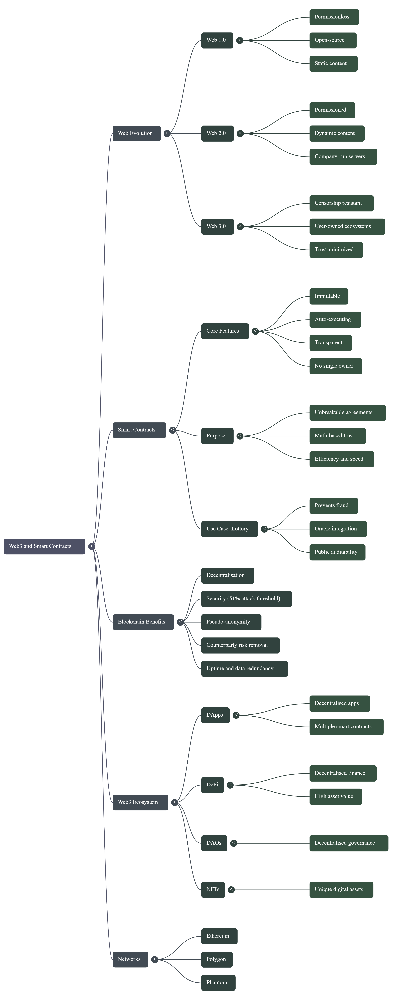

# 📘 Smart Contracts Learning Notes Day 2 Fundamentals

**Date:** **8 January 2026**

## Mindmap of todays learning

## **1️⃣ Blockchain Basics**

* Most blockchain networks run on **Ethereum**, **Polygon**, **Phantom**, etc.
* **Smart Contract vs Blockchain:**

  * **Blockchain:** Decentralized ledger that stores data permanently.
  * **Smart Contract:** Code deployed on blockchain that automatically executes agreements.

---

## **2️⃣ DApp (Decentralized Application)**

* DApp = **Decentralized Application / Protocol / Smart Contract**
* Basically, a DApp is **a combination of multiple smart contracts working together**.

---

## **3️⃣ Web Evolution**

| Web Version | Description                                                                                  |
| ----------- | -------------------------------------------------------------------------------------------- |
| **Web 1.0** | Permissionless, open-source, **static content**.                                             |
| **Web 2.0** | Permissioned, dynamic content, companies control your agreements on servers.                 |
| **Web 3.0** | Permissionless, dynamic content, decentralized, censorship-resistant, user-owned ecosystems. |

**Web3 Key Idea:** Instead of being the product, **users own part of the protocols they interact with**.

---

## **4️⃣ Smart Contracts**

**Definition:** Unbreakable digital agreements.

**Purpose:**

* Create **trust-minimized agreements**.
* Improve **efficiency** and **speed**.
* Automate promises without relying on human honesty.

**Real-life Example:**

* McDonald’s Monopoly scandal → customers were promised a fair chance to win $1 million, but the system was manipulated.
* **With blockchain:**

  * Lottery as smart contract → transparent, immutable, decentralized.
  * Adding **oracles** → external data triggers smart contract automatically.
  * Result: impossible to defraud → trust is now math-based, not brand-based.

**Smart Contract Features:**

* **Immutable:** Cannot be altered.
* **Automatic Execution:** Runs code automatically.
* **Transparent:** Everyone can see the agreement.
* **No Owner:** Nobody can change terms.

**Problem Solved:**

* Traditional agreements require trust, can be manipulated, or take years in court.
* Smart contracts remove **counterparty risk** and enforce agreements automatically.

---

## **5️⃣ Benefits of Blockchain**

* **Decentralized:** Multiple node operators (1000s).
* **Transparency & Flexibility:** Everyone sees activity, but blockchain is **pseudo-anonymous** (not tied to real identity).
* **Speed & Efficiency:** Automated functions, transactions recorded instantly.
* **Security & Immutability:** Very hard to hack (need to control >50% of nodes).
* **Trust-Minimized Agreements:** Promises can’t be broken.
* **Counterparty Risk Removal:** No need to rely on a trusted person or organization.

---

## **6️⃣ DeFi, DAO, NFT**

* **DeFi (Decentralized Finance):** Protocols handling $200B+ in user funds.
* **DAO (Decentralized Autonomous Organization):** Groups governed in a decentralized way.
* **NFT (Non-Fungible Token):** Unique digital assets (like a unique key, art, or asset).

---

✅ **Summary / Key Points:**

* **Smart contracts** = unbreakable promises → trust math, not humans.
* **Blockchain** = decentralized, immutable, transparent, secure ledger.
* **Web3** = permissionless, censorship-resistant, user-owned ecosystem.
* **Major applications:** DeFi, DAOs, NFTs.
* Using blockchain + smart contracts **solves trust issues**, removes counterparty risk, improves speed, efficiency, and security.

